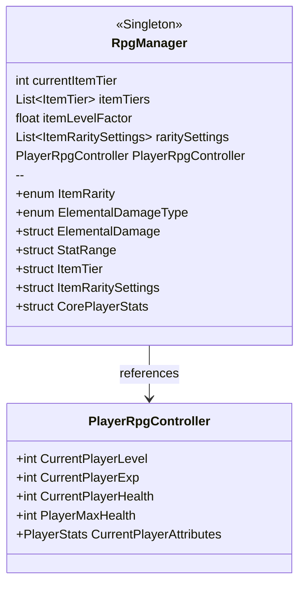
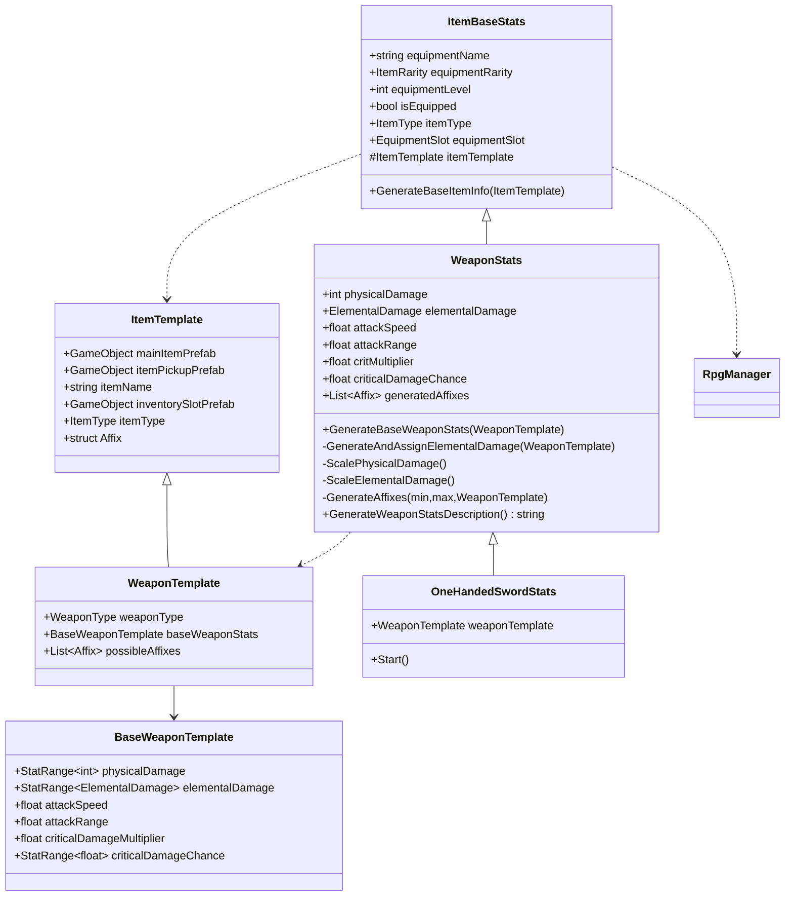
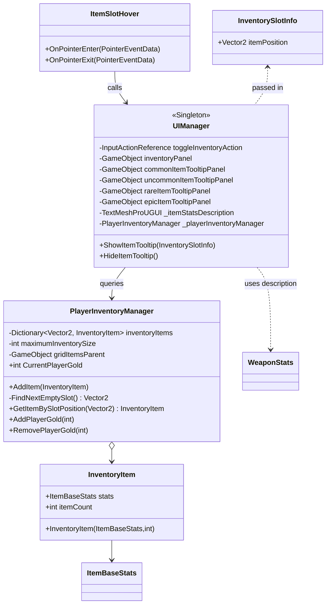
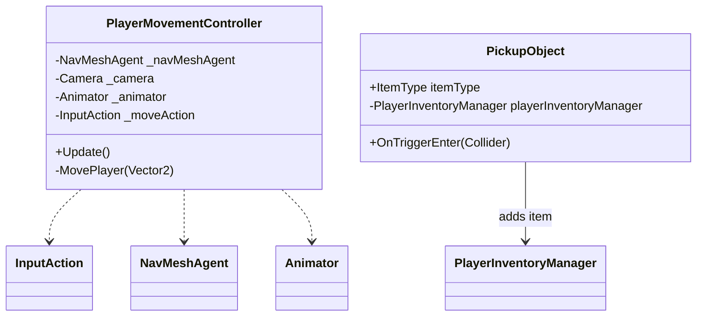

### Class Diagrams (Mermaid)

Copy any diagram block into a Mermaid-enabled viewer (e.g., VSCode with Mermaid extension, Mermaid Live Editor) to render.

---

#### Core System

---

#### Item Templates and Equipment

---

#### Inventory and UI

---

#### Player and World Interaction

