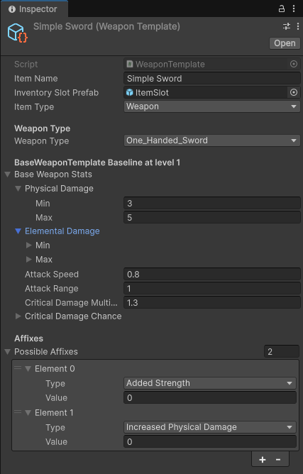

# Project Log 0.1.0

---

## 1. Overview

A 3D top-down action role-playing game in Unity that features an RPG and Inventory system.

## 2. Responsibilities

- Designed and implemented the core gameplay systems.
- Implemented a dynamic user-interface.
- Integrated player locomotion and animation.
- Project management using Kanban Boards on Trello.

## 3. Technical Stack

- Unity 6.3 LTS
- C# 9.0
- Git

## Challenges and Solutions

### Creating the Inventory System
I needed an inventory system that was easy to scale and extend, whilst also providing a clean and intuitive user 
interface. To achieve this, I created a system made of *Scriptable Objects*. This allowed me to create a system that 
was more flexible and extensible, making it easier to add new items and adjust the behaviour of existing items.

**Creating an Item Template**

Creating a new item template is as simple as right-clicking in the project window and selecting 
"Create > Inventory > Items" and then choosing a desired item type. All item template definitions are stored in the 
`/Assets/RPG System` folder. With each type of item in its own respective folder.

## Links

- [GitHub Source Code](https://github.com/SilenceOfTheLambdas/Pyrite)
- [Trello Board](https://trello.com/invite/b/6983a14a69c734a3259c062c/ATTI1883390cb21bd303e45d8f3dba8e5756DA098DE0/pyrite-game)