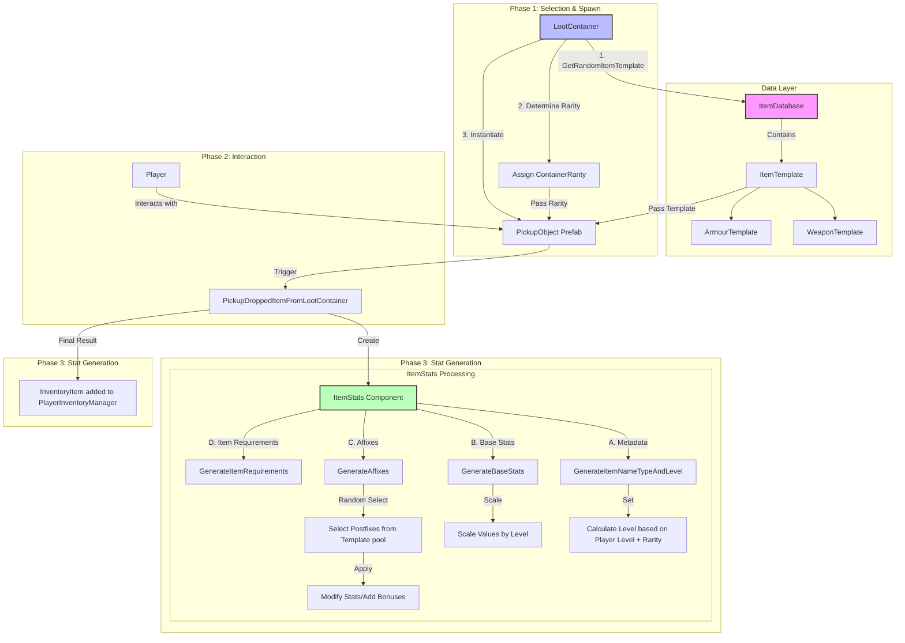
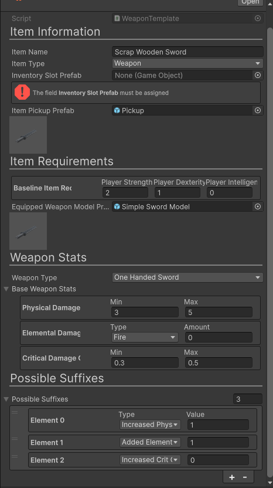
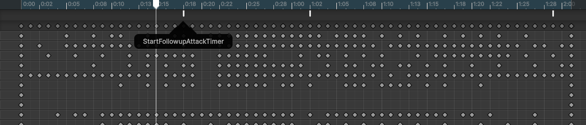

# Project Log

<!-- TOC -->
* [Project Log](#project-log)
  * [Overview](#overview)
    * [Responsibilities](#responsibilities)
    * [Technical Stack](#technical-stack)
* [Challenges and Solutions](#challenges-and-solutions)
  * [Creating the Inventory System](#creating-the-inventory-system)
    * [Creating an Item Template](#creating-an-item-template)
    * [Generating Item Stats](#generating-item-stats)
      * [Final Diagram](#final-diagram)
    * [Update (24/02/26)](#update-240226)
  * [In-world Item Labels](#in-world-item-labels)
    * [Looking at the camera](#looking-at-the-camera)
    * [Setting the label text](#setting-the-label-text)
    * [Positioning the Labels](#positioning-the-labels)
    * [Player Movement & Animations](#player-movement--animations)
* [Links](#links)
* [References](#references)
<!-- TOC -->

## Overview

A 3D top-down action role-playing game in Unity that features an RPG and Inventory system. The aim of this project 
was to create a complete game that I could show to potential employers and release on a platform like Itch.io.
This project log details some stages of development and the challenges that I faced along the way. I also 
discuss some reasoning behind some of the decisions that I made.

### Responsibilities

- Designed and implemented the core gameplay systems.
- Implemented a dynamic user-interface.
- Integrated player locomotion and animation.
- Project management using Kanban Boards on Trello.

### Technical Stack

- Unity 6.3 LTS
- C# 9.0
- Git

# Challenges and Solutions

## Creating the Inventory System

---

I needed an inventory system that was easy to scale and extend, whilst also providing a clean and intuitive user 
interface. To achieve this, I created a system made of *Scriptable Objects*. This allowed me to create a system that 
was more flexible and extensible, making it easier to add new items and adjust the behaviour of existing items.
I chose to use a *ScriptableObject* to store the data for each item type template, as this allowed me to easily 
extend the system to include new item types. It also helped separate data and logic. My inspiration for this system 
was games like Path of Exile[1](#references) and Torchlight[2](#references). I wanted to create a system that was similar to these games in 
respect to item stats and affixes and how they are generated. The challenge was to achieve a system that provided 
depth but still maintained flexibility and simplicity.


```csharp
    [CreateAssetMenu(fileName = "BaseWeaponTemplate", menuName = "Inventory/Items/New ArmourTemplate")]
    public class ArmourTemplate : ItemTemplate
    {
        public ArmourType armourType;
        
        /// <summary>
        /// Baseline stats for this armour type.
        /// </summary>
        public BaselineArmourStats baselineArmourStats;
        
        [Serializable]
        public enum ArmourType
        {
            Head,
            Chest,
            Legs,
            Boots
        }
        
        [Header("Postfixes")] [Description("Provide a list of possible affixes that could apply to this item.")]
        public List<Postfix> possiblePostfixes;
    }
```

Above is the code for the armour template. That contains a property for the armour type, along with a `BaselineArmourStats` 
object that contains the base stats for the armour type at level 1. This type is serialised and exposes all 
properties in the inspector. The `possiblePostfixes` property is a list of `Postfix` objects that *could* be applied 
to this item when its stats are generated.

### Creating an Item Template

Creating a new item template is as simple as right-clicking in the project window and selecting 
"Create > Inventory > Items" and then choosing a desired item type. All item template definitions are stored in the 
`/Assets/RPG System` folder. With each type of item in its own respective folder.

### Generating Item Stats

There are two variables that affect the stats of an item (for example):
- The `baseline{Item}Stats` property stored in the `{Item}Template` class holds **only** the starting stats for an 
  item at level 1.
  - These stats are then scaled in the `{Item}Stats` class.
- In the `{Item}Stats` class, there is a property of type `Baseline{Item}Stats` that's named `Generated{Item}Stats`.
  - This property is used to store the final generated values for all stats for that item.

Items are then generated with the following process:

1. A `PickupObject` is instantiated by a class that is responsible for dropping items, for example, the 
   `LootContainer` class does the following:
   - ```csharp
       public void DropLootAroundContainer()
        {
            if (_hasBeenUsed) return;
            var lastItemPosition = itemDropStartingLocation.position;
            foreach (var itemTemplate in _generatedLootItemsToDrop)
            {
                var dropLocation = lastItemPosition + new Vector3(
                    Random.insideUnitCircle.x * itemDropPositionSpacing,
                    0.5f,
                    Random.insideUnitCircle.y * itemDropPositionSpacing);
                lastItemPosition = dropLocation;
                
                var item = Instantiate(itemTemplate.itemPickupPrefab, dropLocation, Quaternion.identity);
                item.GetComponent<PickupObject>().SetItemRarityAndTemplate(itemTemplate,containerRarity);
            }
            _hasBeenUsed = true;
        }
        ```

2. Once a `PickupObject` has been instantiated it calls the `SetItemRarityAndTemplate()` method on it.

3. Now once the player clicks on the item in the world, the `PlayerItemInteractionController` class then runs the 
   following logic to generate the item's stats:
   - ```csharp
       if (interactableObject.CompareTag("ItemPickup"))
           {
               var pickupObject = interactableObject.GetComponent<PickupObject>();
               pickupObject.PickupDroppedItemFromLootContainer();
           }
     ```
4. Now, the rest of the stats for a given item are generated based on the following logic:
   - ```csharp
     ...
     if (_itemTemplate is not ArmourTemplate armourTemplate)
       {
           Debug.LogError("Unable to get an armour template!");
           return;
       }
       var armourStats = gameObject.AddComponent<ArmourStats>();
       armourStats.GeneratedArmourStats = armourTemplate.baselineArmourStats;
       armourStats.inventorySlotPrefab = armourTemplate.inventorySlotPrefab;
       armourStats.GenerateItemNameTypeAndLevel(armourTemplate, itemRarity);
       armourStats.GenerateArmourStats(armourTemplate!.armourType, armourTemplate);
        
       _playerInventoryManager.AddItem(new InventoryItem(armourStats, 1));
       Destroy(gameObject);
       ...
      ```
   - This is a snippet of code from the `PickupDroppedItemFromLootContainer()` method in the `PickupObject` class,
     it attempts to get the armour template from the itemTemplate that's set for this pickup object. This is done 
     via a switch statement that checks through each `ItemType` that is set via the inspector for the pickup 
     object prefab.
   - Once the template is retrieved and correctly cast to the relevant ItemTemplate type, the code then performs a 
     series of operations to generate the stats for the item.

5. The `GenerateItemNameTypeAndLevel()` method is called from the `PickupObject` class,

   - This method generates the `itemName`, `itemType` and `rarity` properties.
   - The `rarity` property influences the total number of possible affixes that could be applied to the item:
   - | Rarity   | Affix Range |
     | -------- | ----------- |
     | Common   | 0-0         |
     | Uncommon | 1-2         |
     | Rare     | 3-4         |
     | Epic     | 5-6         |

6. The `Generate{Item}Stats()` method is then called (Armour stats, for example):
    
    ```csharp
    public void GenerateArmourStats(ArmourTemplate.ArmourType typeOfArmourToGenerate, ArmourTemplate armourTemplate)
            {
                ArmourType = typeOfArmourToGenerate;
                
                // Map equipment slot from armour type
                switch (typeOfArmourToGenerate)
                {
                    case ArmourTemplate.ArmourType.Head:
                        equipmentSlot = EquipmentSlot.Head;
                        break;
                    case ArmourTemplate.ArmourType.Chest:
                        equipmentSlot = EquipmentSlot.Body;
                        break;
                    case ArmourTemplate.ArmourType.Legs:
                        equipmentSlot = EquipmentSlot.Legs;
                        break;
                    case ArmourTemplate.ArmourType.Boots:
                        equipmentSlot = EquipmentSlot.Feet;
                        break;
                }
    
                // Initialize resistances for all elements at 0 so we can safely add to them.
                InitializeElementalResistances();
    
                // 1) Scale by level and rarity
                ScaleArmourValues();
    
                // 2) Generate affixes from template/rarity
                GeneratedArmourStats.generatedPostfixes = new List<ItemTemplate.Postfix>();
                var raritySettings = RpgManager.Instance.raritySettings
                    .Find(e => e.rarity == equipmentRarity);
                // If rarity allows any affixes, generate them using the ArmourTemplate's possible affixes
                if (raritySettings.rarityAffixBonusRange.max > 0)
                {
                    GenerateAffixes(raritySettings.rarityAffixBonusRange.min,
                        raritySettings.rarityAffixBonusRange.max, armourTemplate);
                }
    
                // 3) Apply post-fixes
                ApplyPostfixes();
                
                // 4) Finally, generate the requirements to equip this item
                GenerateItemRequirements(armourTemplate.baselineItemRequirements);
            }
    ```

This method has a lot going on, but in essence it does the following:

- Assignes the `ArmourType` property provided by the `typeOfArmourToGenerate` parameter.

- The `equipmentSlot` property is then set based on the `typeOfArmourToGenerate` parameter.

- The `InitializeElementalResistances()` method is called to initialise the resistances for all elements to 0 for now.

- The `ScaleArmourValues()` method is called to scale the stats by level and rarity.

- If the rarity allows any affixes, then the `GenerateAffixes(int rarityAffixBonusRangeMin, int rarityAffixBonusRangeMax, ArmourTemplate armourTemplate)` method is called to generate the affixes.

- The `ApplyPostfixes()` method is called to scale the stats based on the postfixes that were generated.

- Finally, the `GenerateItemRequirements(ItemRequirements baselineItemRequirements)` method is called to generate the requirements for this item.

7. Finally, a new `InventoryItem` is created and then added to the player's inventory.

#### Final Diagram


### Update (24/02/26)

As I started developing my project further, I was finding the architecture of the code to be more and more cumbersome.
The inspector also started to look cluttered, and I wasn't happy with the steps needed to create a new item. I always like
to imagine as if another person who isn't experienced with my code is trying to use whatever system I make. Re-creating that
journey left me feeling a bit confused, so I knew I needed to make some changes.

One of the biggest changes I made was adopting an open-source tool called EditorAttributes[3](#references) which implemented
a load of attributes that can be applied to properties to simplify the look and feel of the inspector. I made use of the 
`DataTable`, `Required`, and the various group attributes to make the inspector look cleaner and make it more obvious as
to what properties were required for an item template.




**Now the inspector looks a lot better, with warnings that appear if certain properties are not assigned a value.**

Furthermore, I also renamed postfixes to prefixes to reduce naming fatigue and to also match how PoE names it.

## In-world Item Labels

---

For my game, I wanted to incorporate labels that are displayed over an item that has been dropped in the world.
The system was inspired by games like: Path of Exile, Torchlight 2, and Diablo. These labels should display the name of
the item along with some kind of visual indicator as to the rarity of said item. The feature needed to be performant and 
easy to interact with, as players may be picking-up items in haste.

Creating the initial label over the item was pretty trivial, a simple UI canvas with the render-mode set to 'screen-space'
and set to an appropriate size. A TextMeshPro Text element was then added as a child to this canvas, which will hold the
name of the item. Both of these objects were then added as a child to the ItemPickupPrefab object:
```
- Pickup
  - Model
  - Item Label Canvas
    - Item Label Text
```

### Looking at the camera
To make the label nice and legible, the label needed to face the camera similar to a billboard effect. Making this
happen was very easy, the script `LookAtCamera` gets a reference to `Camera.main` and then uses the `transform.LookAt()`
function to rotate the pickup object so that it faces the camera:

```csharp
transform.LookAt(transform.position + _cameraTransform.rotation * Vector3.forward, _cameraTransform.rotation * Vector3.up);
```

### Setting the label text
The `ItemLabel` monobehaviour is responsible for setting both the label text and the colour of the text based on rarity.

```csharp
/// <summary>
/// Sets the text of the item label that is displayed above the item in the world. And also adjusts the colour
/// of the text based on the rarity colour parameter (item items rarity).
/// </summary>
/// <param name="text"></param>
/// <param name="rarityColour"></param>
public void SetLabelTextAndRarity(string text, Color rarityColour)
{
    if (labelText == null) return;
    
    labelText.text = text;
    labelText.color = rarityColour;
}
```

This function is called from the `PickupObject` behaviour. The `rarityColour` parameter is set using the
`ItemLabel.LabelRarityColour.GetColourForRarity()` method implemented in the `LabelRarityColour` struct implemented in
the `ItemLabel` monobehaviour.

```csharp
itemLabel.SetLabelTextAndRarity(_itemTemplate.itemName, ItemLabel.LabelRarityColour.GetColourForRarity(itemRarity));
```

```csharp
[Serializable]
public struct LabelRarityColour
{
    public static Color CommonColour = Color.white;
    public static Color UncommonColour = new(68, 141, 203);
    public static Color RareColour = new(255, 238, 30);
    public static Color EpicColour = new(220, 0, 255);
    public static Color UniqueColour = new(68, 141, 203);
    
    public static Color GetColourForRarity(RpgManager.ItemRarity rarity)
    {
        return rarity switch
        {
            RpgManager.ItemRarity.Common => CommonColour,
            RpgManager.ItemRarity.Uncommon => UncommonColour,
            RpgManager.ItemRarity.Rare => RareColour,
            RpgManager.ItemRarity.Epic => EpicColour,
            RpgManager.ItemRarity.Unique => UniqueColour,
            _ => CommonColour
        };
    }
}
```

UPDATE (20/02/2026) - There were issues when using the default `Color()` object as this clamps the values between 0 and 1.
When using colours that went up to 255, Unity attempted to clamp the values between 0 & 1 and this led to improper behaviour
where the TextMeshProUGUI colours were not being updated. Rather oddly, the Epic colour did apply but I found-out that 
this was due to the clamping being able to produce a magenta colour which matched the proper colour closely.
The fix for this was simple; I instead used `Color32()` which accepts values up to 255. Now the colours are displayed 
correctly after they are instantiated in the world.

### Positioning the Labels
During testing of the game I found that when multiple items where dropped in the world, the labels would overlap. This
made clicking on them to pick them up and seeing the label text hard. I needed to create a system that adjusted the position
of the labels when another label intersects it.

Due to the label canvases being in world-space, checking for intersections required that the coordinates be interpolated 
in screen-space instead. The function `LabelWorldRectToScreenRect()` does exactly that, it returns a new rectangle in 
screen-space based on the size and position of a world-space rectangle given in the parameters.
`labelRectTransform.GetWorldCorners(worldCorners)` is a unity function that takes-in an empty array of size 4, and outputs
values into that array. This value will be the world-space points of the `labelRectTransform`.
The function uses Unity's `Camera.main.WorldToScreenPoint()` function to calculate the min and max points for a given rect in world-space.

```csharp
private Rect LabelWorldRectToScreenRect(RectTransform labelRectTransform)
{
    var worldCorners = new Vector3[4];
    labelRectTransform.GetWorldCorners(worldCorners);

    Vector2 minScreenPoint = _mainCamera.WorldToScreenPoint(worldCorners[0]);
    Vector2 maxScreenPoint = _mainCamera.WorldToScreenPoint(worldCorners[2]);

    return new Rect(minScreenPoint, maxScreenPoint - minScreenPoint);
}
```

The `ItemLabelManager` monobehaviour stores a list of currently active `ItemLabels` and then each one is checked in the
`LateUpdate()` method:

```csharp
for (var i = 0; i < _labels.Count - 1; i++)
{
    // Convert the world position of the label to screen space and update its position accordingly.
    var screenLabelRectA = LabelWorldRectToScreenRect(_labels[i].GetComponent<RectTransform>());
    var screenLabelRectB = LabelWorldRectToScreenRect(_labels[i+1].GetComponent<RectTransform>());
    if (screenLabelRectA.Overlaps(screenLabelRectB))
    {
        // 1. Get the current screen position including depth of the second label.
        Vector3 screenPosB = _mainCamera.WorldToScreenPoint(_labels[i+1].transform.position);
        
        // 2. Calculate the overlap height in pixels.
        // To push B exactly above A: new Y = Top of A + half height of B (assuming pivot is centre).
        float targetScreenY = screenLabelRectA.yMax + (screenLabelRectB.height * 0.5f);
        
        // 3. Update screen position.
        screenPosB.y = targetScreenY;
        
        // 4. Convert back to world space using the original depth (z) of label B.
        Vector3 newWorldPos = _mainCamera.ScreenToWorldPoint(screenPosB);
        
        // 5. Apply the new position
        _labels[i+1].transform.position = newWorldPos;
    }
}
```
This system will now look at the current ItemLabel and the one next on the list, using the `Overlaps()` function to detect
if two rectangles are overlapping. In my original implementation I didn't account for camera Z-depth which ended-up causing
issues with the labels showing right in-front of the camera and way too high-up in the air. This newer implementation
makes use of the `WorldToScreenPoint()` function and correctly account for the depth of the camera.
Then, the y-position of the second rectangle is pushed upwards based on the size of the label. This new position is then
applied directly to the item label in the list.

### Player Movement & Animations

My original plan for movement in the game was to have movement controlled by the mouse cursor. But, after testing I
decided to change to a WASD movement system. This was easy to implement but did mean that I had to make some important 
design decisions regarding how animations are handled. Most notably, I wanted the player movement to feel responsive whilst
giving 'weight' to attacks.

My basis for how attacks should look is the video game: Path of Exile 2, as this game made use of WASD movement and featured
attack animations. I learnt from playing PoE that the player stops moving when they attack and the animation has 2 'stages'.
The first being an outward slash, and then if the player presses the attack key again (or is still pressing it) an 
inward attack animation is played.


So I implemented a similar animation system to my game; using animations obtained from Mixamo. I developed a system that
first checks to see if a player has a weapon equipped, and then instantiates a weapon model attached to the players' right
hand rig. It will then play the first attack animation: `OutwardSlash`, and if the player then activates the attack button
within a set time, the `InwardSlash` animation is played.

To set up the timing for the animation stages I used animation events. The first starting a timer that acts as a "timer" 
for a follow-up attack. Another event in the `OutwardSlash` animation then stops this "timer".
Finally, at the end of the animation an event is triggered that sets the players' state to idle.



# Links

- [GitHub Source Code](https://github.com/SilenceOfTheLambdas/Pyrite)
- [Trello Board]([https://trello.com/invite/b/6983a14a69c734a3259c062c/ATTI1883390cb21bd303e45d8f3dba8e5756DA098DE0/pyrite-game](https://trello.com/b/pMaj4hAf/pyrite-game))

---

# References

1. Path of Exile - Grinding Gear Games - [Path of Exile Website](https://www.pathofexile.com)
2. Torchlight - Runic Games, Arc Games, Panic Button - [Torchlight 2 Website](https://www.torchlight2.com/en)
3. Editor Attributes - v0lt - [Unity Asset Store Link](https://assetstore.unity.com/packages/tools/gui/editorattributes-269285)
