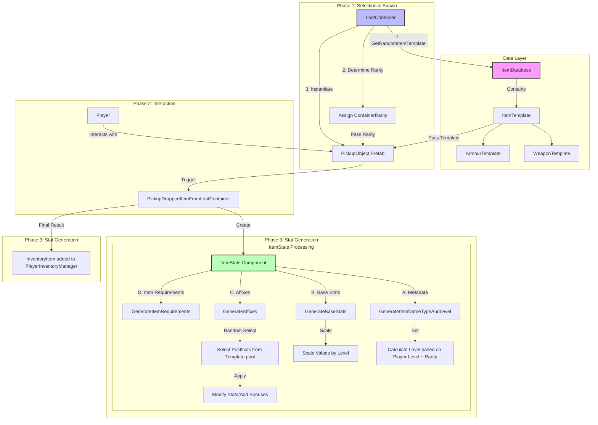

# Project Log 0.1.2

## Overview

A 3D top-down action role-playing game in Unity that features an RPG and Inventory system. The aim of this project 
was to create a complete game that I could show to potential employers and release on a platform like Itch.io.
This project log details some stages of development and the challenges that I faced along the way. I also 
discuss some reasoning behind some of the decisions that I made.

### Responsibilities

- Designed and implemented the core gameplay systems.
- Implemented a dynamic user-interface.
- Integrated player locomotion and animation.
- Project management using Kanban Boards on Trello.

### Technical Stack

- Unity 6.3 LTS
- C# 9.0
- Git

# Challenges and Solutions

## Creating the Inventory System
I needed an inventory system that was easy to scale and extend, whilst also providing a clean and intuitive user 
interface. To achieve this, I created a system made of *Scriptable Objects*. This allowed me to create a system that 
was more flexible and extensible, making it easier to add new items and adjust the behaviour of existing items.
I chose to use a *ScriptableObject* to store the data for each item type template, as this allowed me to easily 
extend the system to include new item types. It also helped separate data and logic. My inspiration for this system 
was games like *Path of Exile* and *Torchlight*. I wanted to create a system that was similar to these games in 
respect to item stats and affixes and how they are generated. The challenge was to achieve a system that provided 
depth but still maintained flexibility and simplicity.


```csharp
    [CreateAssetMenu(fileName = "BaseWeaponTemplate", menuName = "Inventory/Items/New ArmourTemplate")]
    public class ArmourTemplate : ItemTemplate
    {
        public ArmourType armourType;
        
        /// <summary>
        /// Baseline stats for this armour type.
        /// </summary>
        public BaselineArmourStats baselineArmourStats;
        
        [Serializable]
        public enum ArmourType
        {
            Head,
            Chest,
            Legs,
            Boots
        }
        
        [Header("Postfixes")] [Description("Provide a list of possible affixes that could apply to this item.")]
        public List<Postfix> possiblePostfixes;
    }
```

Above is the code for the armour template. That contains a property for the armour type, along with a `BaselineArmourStats` 
object that contains the base stats for the armour type at level 1. This type is serialised and exposes all 
properties in the inspector. The `possiblePostfixes` property is a list of `Postfix` objects that *could* be applied 
to this item when its stats are generated.

### Creating an Item Template

Creating a new item template is as simple as right-clicking in the project window and selecting 
"Create > Inventory > Items" and then choosing a desired item type. All item template definitions are stored in the 
`/Assets/RPG System` folder. With each type of item in its own respective folder.

### Generating Item Stats

There are two variables that affect the stats of an item (for example):
- The `baseline{Item}Stats` property stored in the `{Item}Template` class holds **only** the starting stats for an 
  item at level 1.
  - These stats are then scaled in the `{Item}Stats` class.
- In the `{Item}Stats` class, there is a property of type `Baseline{Item}Stats` that's named `Generated{Item}Stats`.
  - This property is used to store the final generated values for all stats for that item.

Items are then generated with the following process:

1. A `PickupObject` is instantiated by a class that is responsible for dropping items, for example, the 
   `LootContainer` class does the following:
   - ```csharp
       public void DropLootAroundContainer()
        {
            if (_hasBeenUsed) return;
            var lastItemPosition = itemDropStartingLocation.position;
            foreach (var itemTemplate in _generatedLootItemsToDrop)
            {
                var dropLocation = lastItemPosition + new Vector3(
                    Random.insideUnitCircle.x * itemDropPositionSpacing,
                    0.5f,
                    Random.insideUnitCircle.y * itemDropPositionSpacing);
                lastItemPosition = dropLocation;
                
                var item = Instantiate(itemTemplate.itemPickupPrefab, dropLocation, Quaternion.identity);
                item.GetComponent<PickupObject>().SetItemRarityAndTemplate(itemTemplate,containerRarity);
            }
            _hasBeenUsed = true;
        }
        ```

2. Once a `PickupObject` has been instantiated it calls the `SetItemRarityAndTemplate()` method on it.

3. Now once the player clicks on the item in the world, the `PlayerItemInteractionController` class then runs the 
   following logic to generate the item's stats:
   - ```csharp
       if (interactableObject.CompareTag("ItemPickup"))
           {
               var pickupObject = interactableObject.GetComponent<PickupObject>();
               pickupObject.PickupDroppedItemFromLootContainer();
           }
     ```
4. Now, the rest of the stats for a given item are generated based on the following logic:
   - ```csharp
     ...
     if (_itemTemplate is not ArmourTemplate armourTemplate)
       {
           Debug.LogError("Unable to get an armour template!");
           return;
       }
       var armourStats = gameObject.AddComponent<ArmourStats>();
       armourStats.GeneratedArmourStats = armourTemplate.baselineArmourStats;
       armourStats.inventorySlotPrefab = armourTemplate.inventorySlotPrefab;
       armourStats.GenerateItemNameTypeAndLevel(armourTemplate, itemRarity);
       armourStats.GenerateArmourStats(armourTemplate!.armourType, armourTemplate);
        
       _playerInventoryManager.AddItem(new InventoryItem(armourStats, 1));
       Destroy(gameObject);
       ...
      ```
   - This is a snippet of code from the `PickupDroppedItemFromLootContainer()` method in the `PickupObject` class,
     it attempts to get the armour template from the itemTemplate that's set for this pickup object. This is done 
     via a switch statement that checks through each `ItemType` that is set via the inspector for the pickup 
     object prefab.
   - Once the template is retrieved and correctly cast to the relevant ItemTemplate type, the code then performs a 
     series of operations to generate the stats for the item.

5. The `GenerateItemNameTypeAndLevel()` method is called from the `PickupObject` class,

   - This method generates the `itemName`, `itemType` and `rarity` properties.
   - The `rarity` property influences the total number of possible affixes that could be applied to the item:
   - | Rarity   | Affix Range |
     | -------- | ----------- |
     | Common   | 0-0         |
     | Uncommon | 1-2         |
     | Rare     | 3-4         |
     | Epic     | 5-6         |

6. The `Generate{Item}Stats()` method is then called (Armour stats, for example):
    
    ```csharp
    public void GenerateArmourStats(ArmourTemplate.ArmourType typeOfArmourToGenerate, ArmourTemplate armourTemplate)
            {
                ArmourType = typeOfArmourToGenerate;
                
                // Map equipment slot from armour type
                switch (typeOfArmourToGenerate)
                {
                    case ArmourTemplate.ArmourType.Head:
                        equipmentSlot = EquipmentSlot.Head;
                        break;
                    case ArmourTemplate.ArmourType.Chest:
                        equipmentSlot = EquipmentSlot.Body;
                        break;
                    case ArmourTemplate.ArmourType.Legs:
                        equipmentSlot = EquipmentSlot.Legs;
                        break;
                    case ArmourTemplate.ArmourType.Boots:
                        equipmentSlot = EquipmentSlot.Feet;
                        break;
                }
    
                // Initialize resistances for all elements at 0 so we can safely add to them.
                InitializeElementalResistances();
    
                // 1) Scale by level and rarity
                ScaleArmourValues();
    
                // 2) Generate affixes from template/rarity
                GeneratedArmourStats.generatedPostfixes = new List<ItemTemplate.Postfix>();
                var raritySettings = RpgManager.Instance.raritySettings
                    .Find(e => e.rarity == equipmentRarity);
                // If rarity allows any affixes, generate them using the ArmourTemplate's possible affixes
                if (raritySettings.rarityAffixBonusRange.max > 0)
                {
                    GenerateAffixes(raritySettings.rarityAffixBonusRange.min,
                        raritySettings.rarityAffixBonusRange.max, armourTemplate);
                }
    
                // 3) Apply post-fixes
                ApplyPostfixes();
                
                // 4) Finally, generate the requirements to equip this item
                GenerateItemRequirements(armourTemplate.baselineItemRequirements);
            }
    ```

This method has a lot going on, but in essence it does the following:

- Assignes the `ArmourType` property provided by the `typeOfArmourToGenerate` parameter.

- The `equipmentSlot` property is then set based on the `typeOfArmourToGenerate` parameter.

- The `InitializeElementalResistances()` method is called to initialise the resistances for all elements to 0 for now.

- The `ScaleArmourValues()` method is called to scale the stats by level and rarity.

- If the rarity allows any affixes, then the `GenerateAffixes(int rarityAffixBonusRangeMin, int rarityAffixBonusRangeMax, ArmourTemplate armourTemplate)` method is called to generate the affixes.

- The `ApplyPostfixes()` method is called to scale the stats based on the postfixes that were generated.

- Finally, the `GenerateItemRequirements(ItemRequirements baselineItemRequirements)` method is called to generate the requirements for this item.

7. Finally, a new `InventoryItem` is created and then added to the player's inventory.

#### Final Diagram


## Links

- [GitHub Source Code](https://github.com/SilenceOfTheLambdas/Pyrite)
- [Trello Board](https://trello.com/invite/b/6983a14a69c734a3259c062c/ATTI1883390cb21bd303e45d8f3dba8e5756DA098DE0/pyrite-game)